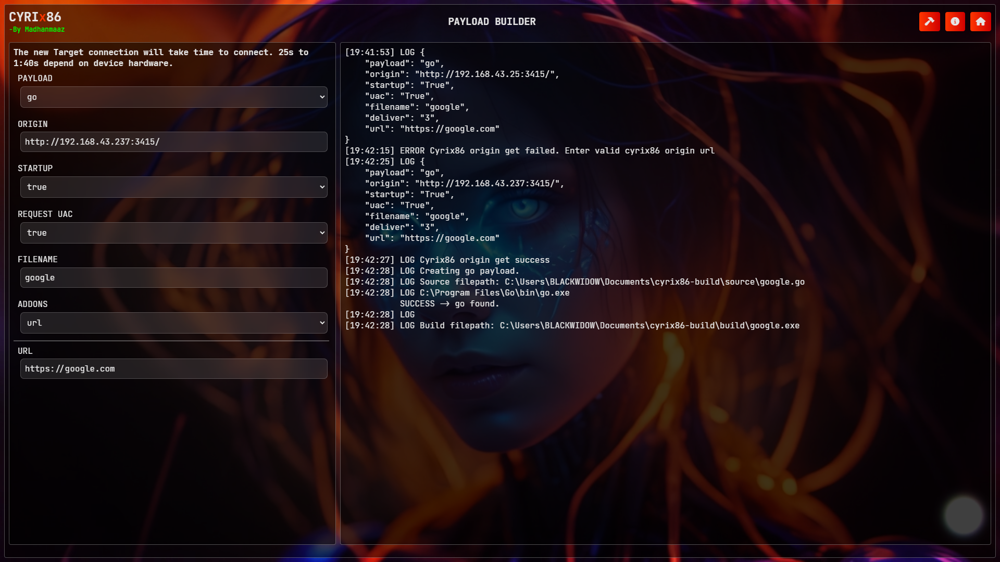
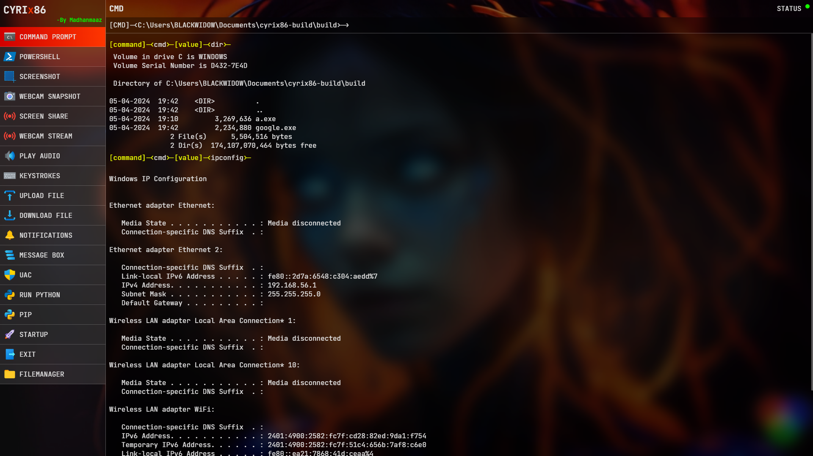

# CYRIX86 - v0.0.1

- Windows high-level `payload`. CYRIx86 provides you with a fully GUI-based control panel for attacks.

### Disclaimer
```
Title: cyrix86
Copyright (c) 2024 Madhanmaaz

All rights owned by Madhanmaaz.

The "cyrix86" tool is an educational resource designed for awareness-raising and ethical purposes only.
It is free to use, but any commercial distribution or sale is restricted.
The tool is intended to be used responsibly and with the explicit permission of the relevant network administrators or owners.
The creators and copyright owners of "cyrix86" are not liable for any misuse or unauthorized use of the tool.

For educational and awareness-raising purposes only. Unauthorized use is prohibited.

Don't try this on your host | main machine.
```

# DEMO

## Online Scanner Results
1. virusscan.jotti.org
    - bat, bat2, c, cmd, cmd2 : [Result](https://virusscan.jotti.org/en-GB/filescanjob/3ns5wo80f4,zf1dzs8a72,l4h1qcyyw0,8p9lgxdxvh,afcnvv3lyg)
    - cpp, cpp2, go, go2, vbs : [Result](https://virusscan.jotti.org/en-GB/filescanjob/zprtd45a5m,4gb50gkxpf,rtne3fpgnh,js7qszejt5,2nahhsuvgj)

2. www.virscan.org
    - bat : [Result](https://www.virscan.org./report/c35a77899e8de2ba9805fc5533bc243cf8842eba4e5cd7dc106264d4c3837a9e) 
    - c : [Result](https://www.virscan.org./report/3a58db7ed8439263a9b09ffab611f801f6051a511e054baae88a665c99929603)

3. www.hybrid-analysis.com
    - bat : [Result](https://www.hybrid-analysis.com/sample/c35a77899e8de2ba9805fc5533bc243cf8842eba4e5cd7dc106264d4c3837a9e)

4. metadefender.opswat.com
    - bat : [Result](https://metadefender.opswat.com/results/file/bzI0MDQwNkJHWDBwN2tKWUdPMHN4WXZkazM_mdaas/regular/overview)

5. online.drweb.com
    - bat : [Result](https://online.drweb.com/result2/?mode=show_stored&id=orc_1712386256_a4ab03f05cb8e4495837f5a1ac3f4517&lng=en)


## Authors
<a href="https://paypal.me/madhanmaaz?country.x=IN&locale.x=en_GB">

</a>

- [@Madhanmaaz](https://www.github.com/madhanmaaz)

## Requirements
- Server
    - [Nodejs](https://nodejs.org/en)
- Build
    - [gcc & g++](https://nuwen.net/mingw.html)
    - [go](https://go.dev/dl/)

## Installation

Install **CYRIx86** with GIT
```bash
git clone https://github.com/madhanmaaz/cyrix86
```
```bash
cd cyrix86
```
- Install Dependencies
```bash
npm install
```
- Run
```bash
npm start
```

### ADD THIS FOLDER TO EXCLUSIONS: (windows only) [Reference](https://support.microsoft.com/en-us/windows/add-an-exclusion-to-windows-security-811816c0-4dfd-af4a-47e4-c301afe13b26#ID0EBF=Windows_10)
```
\path\to\cyrix86\payloads
\Users\<USERNAME>\Documents\cyrix86-build
```

- Open on your browser `http://localhost:3415`
## Credentials
- Username : `admin`

- Password : `admin`

- To change config `./utils/config.js`

- USER-INTERFACE


- Build payload


- Panel


#### CONTROL PANEL OPTIONS
1. Cmd
1. Powershell
1. Screenshot
1. Webcam Snapshot
1. ScreenShare
1. WebcamStream
1. Play Audio
1. KeyStrokes
1. Upload
1. Download
1. Notification
1. Message Box
1. Uac
1. Python
1. Pip
1. Startup
1. Exit
1. Filemanager

#### Supported: Os and Builds
- Windows 10 (1803) from build 17063 or later.